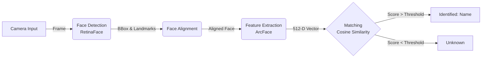

# Face Recognition Based Student Attendance System

<div align="center">


**Hệ thống điểm danh sinh viên thông minh sử dụng Deep Learning với độ chính xác cao.**

[Xem Demo](#-demo-hình-ảnh-screenshots) • [Cài Đặt](#%EF%B8%8F-cài-đặt-installation) • [Cách Dùng](#-hướng-dẫn-sử-dụng-user-guide)

</div>

---

## 📖 Giới Thiệu (Overview)

Dự án này là giải pháp chuyển đổi số cho việc quản lý lớp học, thay thế phương pháp điểm danh truyền thống. Hệ thống tích hợp các mô hình Deep Learning SOTA (**RetinaFace** cho phát hiện và **ArcFace** cho nhận diện) để đảm bảo khả năng nhận diện chính xác trong nhiều điều kiện môi trường khác nhau.

Giao diện người dùng được xây dựng bằng **QML (Qt Quick)**, mang lại trải nghiệm mượt mà, hiện đại và dễ dàng thao tác cho giảng viên.

## 🚀 Tính Năng Nổi Bật (Key Features)

* **⚡ Real-time Inference:** Nhận diện và xử lý luồng video thời gian thực với độ trễ thấp (< 50ms/face).
* **🎯 Robust Accuracy:** Khả năng nhận diện tốt ngay cả khi khuôn mặt bị nghiêng, che khuất một phần, đeo kính hoặc thay đổi biểu cảm.
* **🖥 Modern UI/UX:** Giao diện QML trực quan, hỗ trợ Dark/Light mode (tuỳ chọn).
* **📊 Auto Logging:** Tự động ghi nhận thời gian ra/vào và xuất báo cáo điểm danh ra file Excel (.xlsx) hoặc CSV.
* **🛡 Anti-Spoofing (Basic):** Cơ chế lọc ngưỡng (thresholding) để giảm thiểu nhận diện sai.

## 🛠 Tech Stack

| Thành phần | Công nghệ / Thư viện | Chi tiết |
| :--- | :--- | :--- |
| **Language** | Python 3.8+ | Ngôn ngữ lập trình chính |
| **GUI Framework** | PyQt5 / QML | Giao diện người dùng |
| **Computer Vision** | OpenCV, Pillow | Xử lý ảnh đầu vào |
| **Face Detection** | RetinaFace | Mô hình phát hiện khuôn mặt (InsightFace) |
| **Face Recognition** | ArcFace (ResNet) | Trích xuất đặc trưng khuôn mặt (InsightFace) |
| **Data Processing** | Pandas, NumPy | Xử lý dữ liệu và xuất báo cáo |
| **Optimization** | ONNX Runtime | Tăng tốc độ inference trên CPU/GPU |

## 📂 Cấu Trúc Dự Án (Project Structure)

```bash
Face-Recognition-Attendance/
├── app/                        # Source code chính
│   ├── ui/                     # Giao diện QML (.qml files)
│   ├── core/                   # Logic xử lý AI (Face Engine)
│   ├── controllers/            # Kết nối giữa UI và Logic (Signals/Slots)
│   ├── database/               # Quản lý file log và database
│   └── config.py               # Các tham số cấu hình (Threshold, Camera ID)
├── assets/                     # Tài nguyên tĩnh (Icons, Images)
├── data/                       # Dữ liệu Runtime
│   ├── raw_faces/              # Ảnh chụp mẫu khi đăng ký
│   ├── face_data.pkl           # File chứa Embeddings (Encoded Features)
│   └── attendance_log.csv      # File kết quả điểm danh
├── dataset/                    # Thư mục chứa dữ liệu train (nếu có)
├── scripts/                    # Các script tiện ích
├── main.py                     # Entry point của ứng dụng
├── requirements.txt            # Danh sách thư viện
└── README.md                   # Tài liệu dự án
````

## 🧠 Nguyên Lý Hoạt Động (Workflow)

Hệ thống hoạt động dựa trên pipeline xử lý ảnh 4 bước:



1.  **Face Detection:** Quét toàn bộ khung hình để tìm vị trí khuôn mặt.
2.  **Face Alignment:** Căn chỉnh khuôn mặt dựa trên 5 điểm mốc (mắt, mũi, miệng) để chuẩn hóa góc nhìn.
3.  **Feature Extraction:** Chuyển đổi khuôn mặt thành vector 512 chiều.
4.  **Matching:** So sánh vector hiện tại với cơ sở dữ liệu vector đã đăng ký sử dụng độ đo Cosine Similarity.

## ⚙️ Cài Đặt (Installation)

### 1\. Yêu cầu (Prerequisites)

  * Python 3.8 - 3.10
  * Webcam (hoặc IP Camera)
  * **(Khuyến nghị)** NVIDIA GPU + CUDA để đạt FPS cao nhất.

### 2\. Các bước cài đặt

**Bước 1: Clone Repository**

```bash
git clone [https://github.com/devk1ngz/Face-Recognition-Based-Student-Attendance-System.git](https://github.com/devk1ngz/Face-Recognition-Based-Student-Attendance-System.git)
cd Face-Recognition-Based-Student-Attendance-System
```

**Bước 2: Thiết lập môi trường ảo**

```bash
# Windows
python -m venv venv
.\venv\Scripts\activate

# Linux/macOS
python3 -m venv venv
source venv/bin/activate
```

**Bước 3: Cài đặt thư viện**

```bash
pip install -r requirements.txt
```

> *Lưu ý: Lần đầu chạy, thư viện `insightface` sẽ tự tải model (\~300MB), quá trình này có thể mất vài phút.*

## 📖 Hướng Dẫn Sử Dụng (User Guide)

1.  **Khởi chạy:**

    ```bash
    python main.py
    ```

2.  **Đăng ký sinh viên mới:**

      * Vào Tab **"Quản lý sinh viên"**.
      * Nhập MSSV và Họ Tên.
      * Nhấn **"Chụp ảnh mẫu"** (Hệ thống sẽ chụp 5-10 ảnh ở các góc độ).
      * Nhấn **"Cập nhật dữ liệu"** (Train) để tạo vector đặc trưng.

3.  **Điểm danh:**

      * Quay lại màn hình **Dashboard**.
      * Hệ thống tự động nhận diện và hiển thị thông tin lên màn hình.
      * Kết quả được lưu tự động vào `data/attendance_log.csv`.

## 📸 Demo Hình Ảnh (Screenshots)


## 🗺️ Roadmap

  - [x] Tích hợp Core AI (RetinaFace, ArcFace).
  - [x] Hoàn thiện GUI cơ bản với QML.
  - [x] Xuất báo cáo Excel.
  - [ ] Tích hợp Database SQLite/MySQL.
  - [ ] Xây dựng Web Dashboard để xem báo cáo từ xa.
  - [ ] Gửi thông báo điểm danh qua Telegram/Email.

## 🤝 Đóng Góp (Contributing)

Mọi đóng góp (Pull Requests, Issues) đều được hoan nghênh\!
Nếu bạn thấy dự án hữu ích, hãy để lại một ⭐ **Star** nhé\!

## 📄 License

Dự án thuộc bản quyền **MIT License**.

-----

**Author:** [Devk1ngz](https://www.google.com/search?q=https://github.com/devk1ngz)

```
```